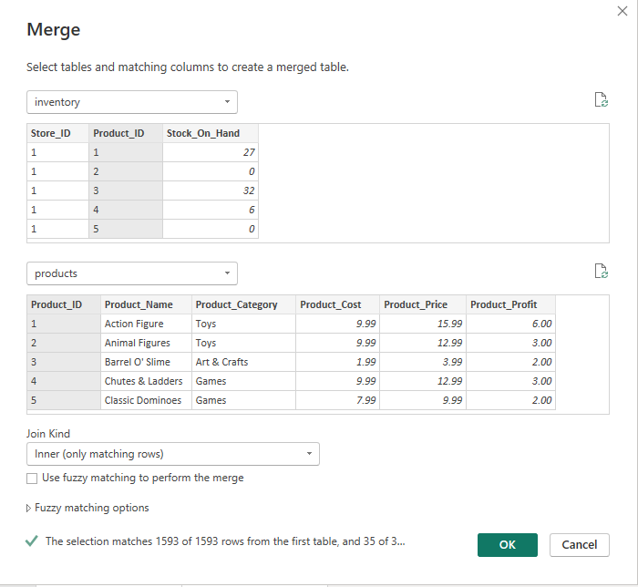
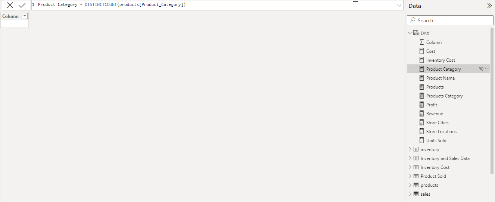
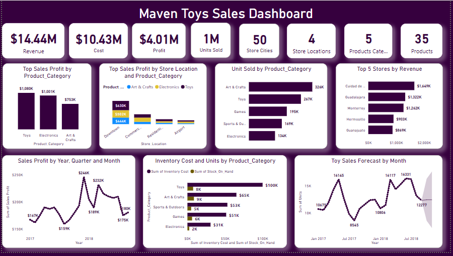

# Mexico-Toy-Sales-Dashboard
This analysis is for a chain of toy stores in Mexico called Maven Toys. The dashboard shows the company’s overall performance at a glance based on the recommended analysis. The picture below is gotten from feepik websites

## Introduction
This sales analysis dashboard was analyzed on Power BI. The dataset used is a fictitious chain of toy stores in Mexico called Maven Toys which include information about products, stores, daily transactions, and current inventory levels at each location. The dashboard is titled ‘Maven Toys Sales Dashboard’.

This project shows my ability to create dashboards with well-defined KPIs to provide a clear and measurable way to assess performance. I was able to align the dashboard with the organization's strategic objectives by highlighting the most critical metrics that directly contribute to business goals.

## Problem Statement
The goal was to create a dashboard to help Maven Toys:
* Identify product categories that drive the biggest profits and verify if it is the same across store locations
* Discover seasonal trends or patterns in the sales data if there’s any
* Detect if there are lost of sales with out-of-stock products at certain locations
* Ascertain the amount of money tied up in inventory at the toy stores and forecast the period it will last.

## Data Source
The data used for this analysis was found on maven analytics data playgroung. You can get the dataset and other datasets 

## Skills and Concept Demonstrated
Power BI Concepts like;
* Transforming and cleaning data using Power Query Editor.
* Merging tables to generate more insights
* Creating DAX functions for aggregation, filtering, and calculations.
* Creating key performance indicators (KPIs) and other business calculations
* Designing dashboard for a cohesive view of key performance indicators.
* Translating business requirements into dashboard specifications.
* Data visualization

## Data Transformation
Imported the file into Power BI through Text/CSV then clicked on 'Tranform Data' and added other datasets into Power Query Editor.
I transformed the data in Power Query, checked for Colum quality and consistency of data types
Merged inventory and product table using their primary key 'Product ID' to calculate the cost of inventory as it’s only product table that contains the amount
Also in Power Query, I merged sales and product table to get sold product and some business calculations.
* Tables Merged

## Data Analysis 
On Power BI, created measures using DAX. Several expressions and functions were made to arrive at the desired Metrics.
* DAX

## Data visualization
The dashboard highlight the key Performance Indicators. It shows the total revenue the company generated all through the financial year, the profit, total cost incurred, number of stores, number of product categories, quantities of product sold and total number of product sold.

* Dashboard

## Analysis 
* Downtown and Residential locations had Toys for their top product category. On the other hand, Electronics is the top product category for Commercial and Airport.
* Total revenue trended upward boasting a remarkable increase from January 2023 to July 2023
* Profit gained from Arts and Crafts continue to increase overtime.
* Colorbuds under Electronics category is the top product category with 20.80% contribution in terms of overall profit. 
* Games and Sports & Outdoors are most profitable in December 2017. On the other hand, Toys sales each month are always above average.

## Recommendation
* Check the opportunities of adding stores in Airports. Currently, there are only three stores and two of them are major contributors in profits.
* The company should continue to focus on the growth of Arts & Crafts as their profit continue to increase overtime.
* Increase promotion in Ciudad de Mexico, Guadalajara, Hermosillo and Monterrey since majority of the stock cost are tied to these cities.

## Thank you for reading.
I am open to data roles.
Looking forward to meeting you!
